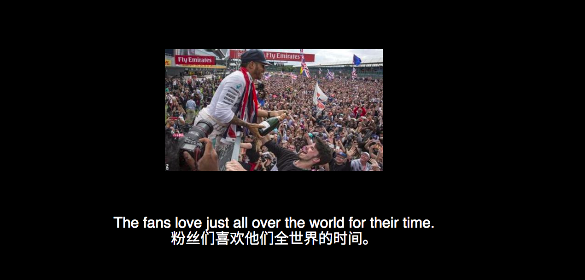
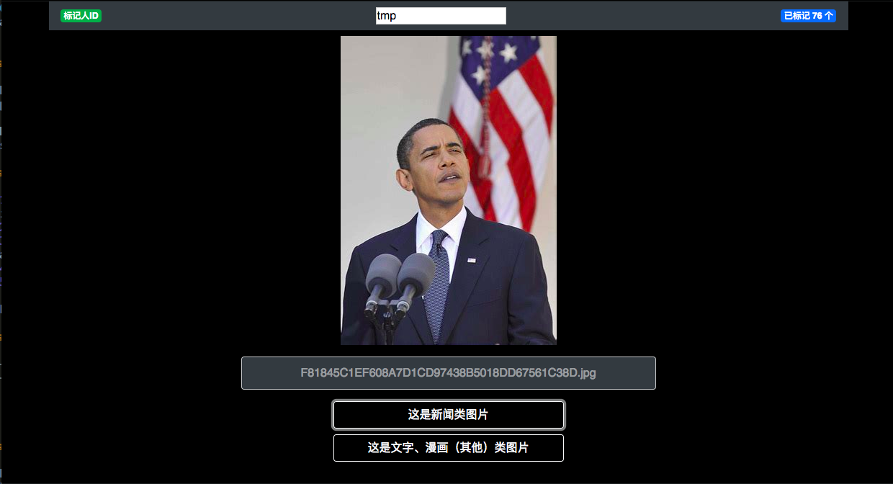

# EdreamProject
E-dream Art Project

[Demo Video](https://vimeo.com/273002578)

## V3 version

* use java backend

-------

# 1. Web Design

## Nginx(Static Content) + Django(Update Dream Story & Serve Template Page)

<code>
    sudo docker run --name dream -v /home/ubuntu/edream/nginx/nginx.conf:/etc/nginx/nginx.conf:ro -v /home/ubuntu/edream/nginx/logs:/home/ubuntu/edream/nginx/logs -v /home/ubuntu/edream/nginx/static:/home/ubuntu/edream/nginx/static:ro -p 9002:9002  -d nginx
</code>

# 2. Image & Translation & Speech Synthesize

## BingAPI + GoogleAPI

# 3. Story Generation

## GAN

 
<b>E-Dream</b>
 
An art project.

# 4. News Image Filtering

## Image Classifier

